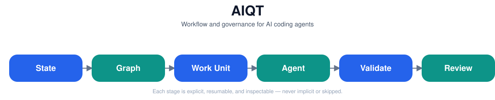

<div align="center">

# AIQT

### Workflow and governance for AI coding agents

**Plan · Execute · Validate · Review · Govern**

Local-first · Agent-agnostic · Resumable

[](https://github.com/JoaomdvFerreira/aiqt/actions/workflows/validate.yml)
[](package.json)
[](tsconfig.json)
[](package.json)

</div>

<p align="center">
  
</p>

AIQT is a **local CLI workflow and governance engine** for software
development with AI coding agents. It is not another coding model — it
controls the *workflow state, bounded work, validation, evidence, review,
and governed autonomous execution* around whatever agent (or human) is
doing the work.

## Why AIQT?

| Without workflow control | With AIQT |
|---|---|
| Huge / repeated context | Bounded execution context |
| Lost progress between sessions | Resumable workflow state |
| Vague agent tasks | Explicit Work Units |
| Ad-hoc validation | Evidence-driven checkpoints |
| Uncontrolled automation | Controlled / sandboxed execution |
| "Looks done" | Review and governance |

## Quick Start

```bash
pnpm install && pnpm build
aiqt init
aiqt plan --file my-plan.json
aiqt next
```

`aiqt next` hands your agent one bounded Work Unit at a time — a
self-contained packet with objective, scope, and acceptance criteria. Every
command supports `--json`; see
[`docs/governance/cli-machine-contract.md`](docs/governance/cli-machine-contract.md).

## Core Capabilities

| | Capability |
|---|---|
| 🧭 | Structured and resumable workflow state |
| 📦 | Bounded Work Unit handoffs |
| ✅ | Checkpoints and validation evidence |
| 🔍 | Review and workflow-health inspection |
| 🤖 | Controlled autonomous maintenance |
| 🛡️ | Sandboxed live agent execution |
| 📊 | Deterministic CLI / JSON contracts |
| 🧾 | Generated reports and governance evidence |

## Ownership Model

```
   Human                AIQT                 Coding Agent            AIQT
 owns intent    →   owns workflow control →  owns implementation  →  validates
                                                                       progress
                                                                       & evidence
```

## The Workflow Journey

```bash
aiqt init                 # create the canonical .aiqt/ workflow state
aiqt update                # capture durable project context
aiqt plan                  # ingest a structured plan into the work graph
aiqt next                  # hand out the next ready Work Unit

# → the coding agent implements one bounded Work Unit →

aiqt checkpoint             # record the validated result
aiqt review                 # full-project integrity & quality findings
```

<table>
<tr><th>Core Workflow</th><th>Governance</th><th>Autonomous</th></tr>
<tr valign="top"><td>

`init`
`update`
`plan`
`next`
`checkpoint` / `amend`

</td><td>

`review`
`status`
`manage`
`export`
`graph validate/repair`
`evidence` gate / import

</td><td>

`autonomous inspect`
`autonomous classify`
`autonomous approve`
`autonomous run`
`autonomous status`
`autonomous cancel`
`autonomous result`
`autonomous cleanup`

</td></tr>
</table>

Run `aiqt --help` for the full, current command list.

## Controlled Autonomy, Not Blind Autonomy

```
Inspect → Classify → Approve → Sandbox → Execute → Validate → Result
```

AIQT can run policy-checked autonomous maintenance against an isolated Git
worktree, optionally **inside a Docker sandbox** (network-denied,
resource-capped, escape-tested) — never as unattended, unbounded
automation. Every run is gated by:

- **budgets** — bounded command/time/resource limits;
- **command classes** — each proposed command is classified before it runs;
- **sandbox boundaries** — no network, capped CPU/memory/disk/processes;
- **validation evidence** — real, recorded proof, not a self-reported claim;
- **explicit approval** — nothing executes without an approved candidate.

## Documentation

- 📘 **Product** — [`docs/product/`](docs/product/)
- ⚙️ **Governance** — [`docs/governance/`](docs/governance/)
- 🏗️ **Milestones** — [`docs/milestones/`](docs/milestones/)

## Roadmap

```
✅ M38  Sandboxed Live Agent Execution
▶  M39  Agent Execution Efficiency & Context Control
○  M40  Release Governance, Risk Assessment & Provenance
○  M41  Adaptive Test Selection & Feedback Acceleration
○  M42  Defect Discovery, Triage & Remediation Queue
○  M43  Project Structural Review & Issue Discovery
○  M44  Historical Release Reconstruction
○  M45  Background Maintenance Scheduling
○  M46  Multi-Repository Portfolio Governance
○  M47  Controlled Pull Request Integration
```

## Development

```bash
pnpm install
pnpm validate   # typecheck + lint + build + test + version:check
```

See [`docs/governance/versioning.md`](docs/governance/versioning.md) for
versioning/release rules and [`SECURITY.md`](SECURITY.md) for the security
policy.

---

<div align="center">

UNLICENSED — see <a href="package.json">package.json</a>

</div>
